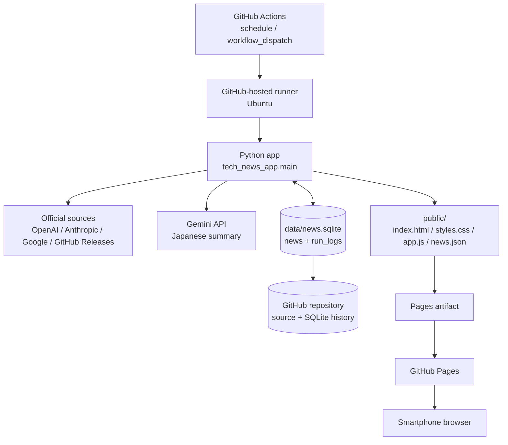
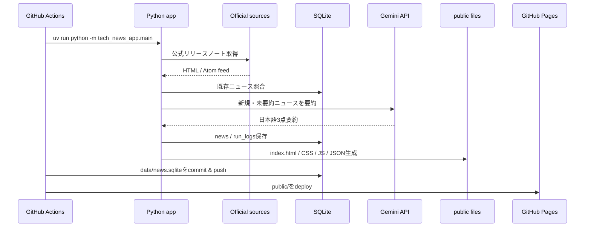

# tech_news_app アーキテクチャ

このドキュメントは、`tech_news_app` がどのサービス・ファイル・処理を使って毎朝のニュースページを生成するかを説明します。

## 全体構成



## 処理フロー

### 1. GitHub Actionsが起動する

`.github/workflows/tech_news_app.yml` が起点です。

起動方法は2つあります。

- 毎日JST 03:07頃の定期実行
- GitHub Actions画面からの手動実行

GitHub ActionsのcronはUTC基準なので、workflowでは `7 18 * * *` を指定しています。これはJSTでは翌日03:07です。03:00ちょうどではなく03:07にしているのは、GitHub Actionsの毎時0分付近の混雑を避けるためです。

### 2. Runner上でPython環境を作る

GitHub-hosted runner上で以下を実行します。

1. リポジトリをcheckout
2. Python 3.12をセットアップ
3. `uv`をセットアップ
4. `uv sync --locked --all-extras` で依存関係を復元
5. `uv run pytest` でテストを実行

この段階でテストが失敗すると、ニュース取得やPagesデプロイには進みません。

### 3. 公式ソースからニュースを取得する

Pythonアプリは `src/tech_news_app/fetchers.py` と `parser.py` を使って、公式または公式に準ずる一次情報だけを取得します。

対象は以下です。

- OpenAI Help: ChatGPT Release Notes
- Anthropic Support: Claude Release Notes
- Anthropic Docs: Claude Code Changelog
- GitHub Releases: `anthropics/claude-code`
- Google: Gemini Release Notes
- OpenAI: Codex Changelog

取得元ごとにHTML構造が違うため、パーサーはソース別に分けています。1つのソース取得に失敗しても、他のソースの取得とHTML生成は継続します。

### 4. Gemini APIで日本語要約する

`GEMINI_API_KEY` がGitHub ActionsのRepository Secretに設定されている場合、`src/tech_news_app/summarizer.py` がGemini APIを呼び出して日本語要約を生成します。

使用モデルは環境変数で指定します。

```text
GEMINI_MODEL=gemini-2.5-flash-lite
```

無料枠のレート制限を避けるため、呼び出し間隔は以下で制御します。

```text
GEMINI_MIN_INTERVAL_SECONDS=4.1
```

Gemini APIキーが未設定、API呼び出し失敗、レート制限、その他エラーの場合でもアプリは止まりません。その場合は、英語本文を長く表示せず、以下の定型文にフォールバックします。

```text
要約未生成。公式ページで確認してください。
```

### 5. SQLiteへニュースと実行ログを保存する

保存先は以下です。

```text
data/news.sqlite
```

SQLiteには主に2種類のデータを保存します。

- `news`: ニュース本文、要約、URL、公開日、重要度、重複判定用hashなど
- `run_logs`: 実行日時、成功/部分成功/失敗、新規件数、エラー概要など

重複判定は次の観点で行います。

- 同じ `item_url`
- 同じ `product + title + published_at`
- 同じ `content_hash`

GitHub-hosted runnerは実行ごとに破棄されるため、SQLiteをrunner内に置くだけでは次回へ引き継げません。そのため、workflowの最後で `data/news.sqlite` をGitHubリポジトリへcommitしてpushします。

### 6. GitHub Pages用の静的ファイルを生成する

`src/tech_news_app/renderer.py` が以下を生成します。

```text
public/index.html
public/styles.css
public/app.js
public/news.json
```

役割は次のとおりです。

- `index.html`: アプリの外枠、フィルタUI、読み込み先の定義
- `styles.css`: スマホ優先のカードUI、stickyフィルタ、グラデーション背景
- `app.js`: Product / Month / Importance / Searchフィルタ、カード開閉、初期表示制御
- `news.json`: ニュースデータ本体

HTMLにニュース全件を直接埋め込まず、`news.json` をJavaScriptで読み込む構成です。これにより、初期表示ではニュースを絞り込みつつ、フィルタや「さらに表示」で過去ニュースへアクセスできます。

### 7. GitHub Pagesへデプロイする

workflowは `public/` をPages artifactとしてアップロードし、`actions/deploy-pages` でGitHub Pagesへ配信します。

スマホからはGitHub PagesのURLへアクセスします。

```text
https://meak-c.github.io/tech_news_app-/
```

ブラウザは `index.html` を読み込み、その後 `styles.css`、`app.js`、`news.json` を取得してニュースダッシュボードを表示します。

## 主要コンポーネント

| コンポーネント | 役割 |
|---|---|
| GitHub Actions | 定期実行、テスト、ニュース生成、DB永続化、Pagesデプロイ |
| GitHub-hosted runner | Pythonアプリを実行する一時的なUbuntu環境 |
| uv | Python依存関係の解決と実行 |
| Python app | 取得、解析、要約、保存、静的ファイル生成 |
| Gemini API | 日本語要約生成 |
| SQLite | ニュース履歴と実行ログの保存 |
| GitHub repository | ソースコードとSQLiteの永続化 |
| GitHub Pages | スマホから閲覧する静的サイト配信 |
| Vanilla JavaScript | フィルタ、検索、カード開閉、初期表示制御 |

## データの流れ



## 運用上の注意

- Gemini APIキーはGitHub Secretsの `GEMINI_API_KEY` に保存します。
- APIキーの実値はMarkdown、ソースコード、HTML、JSON、SQLite、ログへ書きません。
- Free Tier運用では、Geminiへ送る内容を公開済み公式リリースノートに限定します。
- GitHub Pages artifactだけではSQLiteは永続化されないため、DBをリポジトリへcommitします。
- SQLiteはバイナリファイルなので、長期運用では履歴サイズが増えます。
- 取得元サイトのHTML構造変更で一部パーサーが壊れる可能性があります。その場合も他ソースの取得とHTML生成は継続する設計です。
